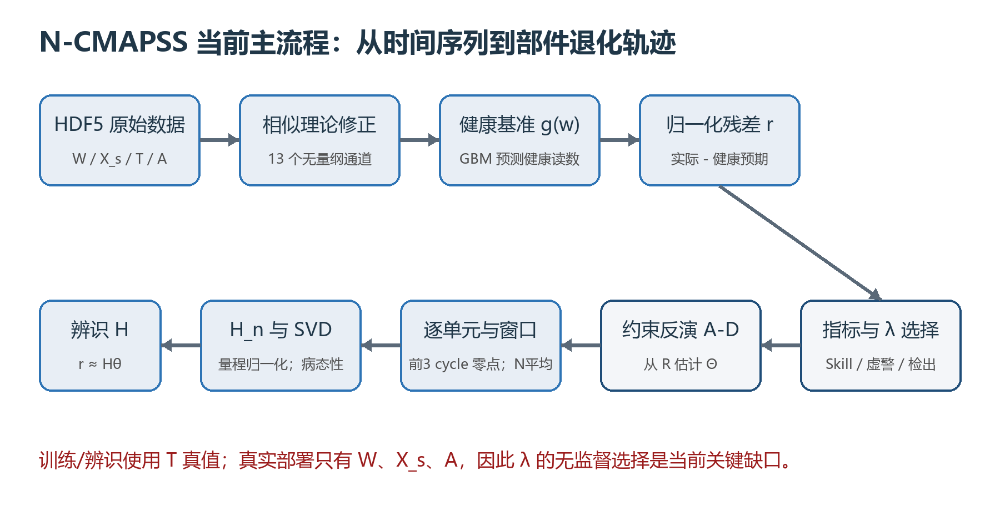

# N-CMAPSS 故障诊断项目学习手册

> 版本：基于 2026-07-13 文件夹现状整理。读者假设：不了解项目、编程基础较弱，但希望真正理解每一步为什么存在、代码做了什么、结论是否可信。

## 0. 先看结论：这个项目现在到底做到哪一步了

一句话概括：这个项目正在把 N-CMAPSS 的传感器数据变成“部件健康参数退化量”的估计问题，核心路线不是直接训练一个故障分类神经网络，而是先建立健康基准、计算传感器残差、辨识影响矩阵 H，再用带物理约束的逆问题求解器反推出部件退化。

目前已经完成的主体工作是：

- 已经摸清主要 N-CMAPSS 子集的失效参数、单元数量和失效模式。
- 已经用相似理论构造 13 个修正传感器通道，并用健康样本拟合工作点相关的健康基准函数 g(w)。
- 已经从多个相对“干净”的子集辨识出 9 个健康参数对应的影响矩阵 H；完整 10 维中的 `HPT_flow_mod` 仍缺失。
- 已经按真实退化量程归一化 H，确认该逆问题高度病态：13×9 的 H_n 条件数约 1562.8，最小奇异值约 0.183σ。
- 已经实现并比较无约束最小二乘、岭回归、物理约束、物理约束加收缩等反演器。
- 最新结果显示：在同一 λ 下，方法 D（约束+收缩）在 168 个“子集×窗口×λ”聚合网格点中的 165 个优于方法 B（纯岭回归），占优率 98.2%，因此 P1 通过。
- 最新结果也显示：方法 D 的虚警更低、检出相关性不差，因此 P3 通过。
- 但“怎样在没有健康参数真值时自动选择 λ”还没有解决。最新版 `script/unsup_out/verdict.json` 中 P2、P2a、P2b、P2c 全部失败；`18b.py` 的交叉选择也没有通过预设阈值。

> 当前最诚实的状态是：物理约束的有效性已有较强证据，但可部署的无监督 λ 选择仍未解决，所以还不能说完整故障诊断流程已经落地。

这个项目现在也还不是一个完整的“多故障分类系统”。它更接近：

1. 用残差判断发动机是否偏离健康状态；
2. 用 H 的方向结构判断偏离更像哪个部件；
3. 用逆问题估计每个健康参数退化了多少；
4. 用非正、单调等约束减少不符合物理规律的解。

尚未完成的关键内容包括：可靠的无监督 λ 选择、完整 10 维 H、工况自适应 H(w) 实验、重复随机种子与置信区间、正式的故障类别决策规则、模型保存与推理接口、项目配置/测试/依赖文件，以及 DS08 等更复杂场景的系统验证。

## 1. 阅读本手册的方法

建议按以下顺序学习：

1. 先读第 2～4 章，建立“数据是什么、项目要解决什么、整条流水线怎样流动”的全局认识。
2. 再读第 5～7 章，理解修正参数、健康基准、残差、H、SVD 和反演器。
3. 然后读第 8 章的脚本演化史。这里会告诉你哪些脚本结论已经被后续脚本修正。
4. 最后读第 9～12 章，掌握当前有效结果、风险、复现方式和下一步路线。

不要试图第一次就逐行背代码。更有效的方式是，每看到一段代码都回答四个问题：

- 输入是什么？
- 输出是什么？
- 数学上做了什么？
- 这一步解决了前面哪个问题？

## 2. 文件夹全景图

项目根目录只有五类真正需要关注的内容。

| 路径 | 类型 | 作用 | 当前评价 |
|---|---|---|---|
| `N-CMAPSS_Example_data_loading_and_exploration.ipynb` | Notebook | NASA/作者风格的 DS02 数据探索示例，读取全部 651.7 万时间点并画工况、退化、传感器图 | 适合认识数据，但内存占用很大，不是当前主算法入口 |
| `script/*.py` | Python 脚本 | 从探索、H 辨识、审计，到约束反演和 λ 选择的研究演化链 | 当前项目的核心 |
| `script/*_out/` | 脚本产物 | 后期脚本生成的 CSV、JSON 和图 | 判断当前结论时优先看这里的最新文件 |
| `results/tables`、`results/pictures` | 早期产物 | 早期特征工程、HPT 回归、H 矩阵和图 | 有学习价值，但部分源脚本已经不在文件夹里，复现链不完整 |
| `.venv`、`.idea`、`PyCharmMiscProject.iml` | 开发环境 | PyCharm 配置和 Python 虚拟环境 | 与算法无关；当前 `.venv` 缺少若干核心依赖 |

### 2.1 脚本编号为什么不连续

现有脚本编号为 01、07、08、09、11、12、13、15、16、17、18、18b。02～06、10、14 没有源代码，19 只在注释中被规划但尚未出现。

这意味着项目并不是一套从头整理好的软件，而是 AI 助手与用户多轮实验后留下的“研究过程快照”。`results/pictures` 中的 `feature_validation.png`、`baseline_model_ablation.png`、`refined_model_results.png` 等明显来自缺失的早期脚本；`script/phase0h_out` 很可能来自缺失的脚本14。它们可以帮助理解思想演变，但不能单独作为可复现证据。

### 2.2 输出为什么散落在不同位置

很多脚本把输出目录写成相对路径，例如 `OUT_DIR = "./unsup_out"`。相对路径不是“相对脚本文件”，而是“相对运行命令时所在的当前目录”。

- 如果在项目根目录运行，输出可能出现在根目录。
- 如果先进入 `script` 再运行，输出会出现在 `script/unsup_out`。
- `results/phase0_out` 与 `script/phase0_out` 的重复，就是这类工作目录差异和人工移动造成的。

这不是算法错误，但会让产物来源难追踪。后续应把输出路径写成基于 `__file__` 的绝对项目路径。

## 3. N-CMAPSS 数据到底是什么

N-CMAPSS 用发动机仿真模型生成完整飞行任务中的多变量传感器序列。它和常见的简化 C-MAPSS 数据不同：一个 cycle 不是一行，而是一整次飞行中的大量时间采样点。

### 3.1 HDF5 文件中的六类矩阵

| 符号/键 | 含义 | 典型列 | 在本项目中的用途 |
|---|---|---|---|
| `W_dev/test` | 工况描述 | `alt`, `Mach`, `TRA`, `T2` | 描述飞行高度、速度、推力设定和入口温度 |
| `X_s_dev/test` | 物理传感器 | `T24`, `T30`, `T48`, `P24`, `Nf`, `Nc`, `Wf` 等 14 列 | 真实可测信号，是诊断输入 |
| `X_v_dev/test` | 虚拟传感器 | 模型内部量、喘振裕度等 14 列 | Notebook 用于探索；当前主算法没有使用 |
| `T_dev/test` | 健康参数真值 | fan/LPC/HPC/HPT/LPT 的效率与流量修正，共 10 列 | 训练 H、评估反演结果的监督真值 |
| `A_dev/test` | 辅助信息 | `unit`, `cycle`, `Fc`, `hs` | 分发动机、分循环、识别飞行等级和健康阶段 |
| `Y_dev/test` | RUL | 剩余寿命 | Notebook 读入，但当前项目没有做 RUL 预测 |

注意：数值矩阵和列名是分开存的。例如 `T_dev` 只有数字，`T_var` 才保存列名；列名通常还是 bytes，必须 `.decode()`。

### 3.2 一个非常重要的纠正：健康参数不是“接近 1”

`01explore_ncmapss.py` 的早期注释写过“健康值接近 1.0”，但实际 Notebook 和后续 CSV 显示，这里的健康参数是相对修正量：健康附近约为 0，退化后通常向负方向变化。例如 DS02 的 `HPT_eff_mod` 最深约为 -0.018668。

因此正确理解是：

- 0 附近：接近初始/健康状态；
- 更负：退化更深；
- 当前约束 `θ≤0` 的物理含义是健康参数不能朝“优于初始状态”的方向跑。

### 3.3 dev、test、unit、cycle、时间点的层级

可以把数据理解成四层：

1. 子集 DS02、DS03 等；
2. dev/test 划分；
3. 多台发动机 unit；
4. 每台发动机经历多个 flight cycle，每个 cycle 内又有许多时间采样点。

Notebook 对 DS02 的统计为 6,517,190 个时间点、9 台发动机，单台发动机约 59～89 个 flight cycle。当前后期脚本会在每个 `(unit, cycle)` 内最多抽 1000 个时间点，再构造 N=1、10、100、1000 的平均窗口。

### 3.4 各子集的失效参数地图

| 子集 | 主要退化参数 | 适合做什么 | 限制 |
|---|---|---|---|
| DS01 | `HPT_eff_mod` | 辨识最干净的 HPT 效率指纹 | 只有 1 个参数，不能测试多故障隔离 |
| DS02 | HPT 效率；部分 dev 单元还含 LPT 效率与流量 | 检验 HPT+LPT 复合故障；dev 中有两种模式 | test 只有一种失效模式，不适合直接做多类别测试 |
| DS03 | HPT 效率 + LPT 效率 + LPT 流量 | 第二个独立复合故障验证集 | dev/test 都基本只有一种模式 |
| DS04 | fan 效率 + fan 流量 | 辨识 fan 两列 | 两参数相关，需要稳定性审计 |
| DS05 | HPC 效率 + HPC 流量 | 辨识 HPC 两列 | 两参数相关，需要稳定性审计 |
| DS06 | LPC 效率/流量 + HPC 效率/流量 | 补 LPC 两列 | 四参数同时变化，辨识难度更高 |
| DS07 | LPT 效率 + LPT 流量 | 辨识 LPT 两列 | 两参数相关，需要稳定性审计 |
| DS08a/c | 10 个健康参数全部退化 | 最接近全维复杂场景 | 共线性严重；当前主流程没有完成系统验证 |

DS08d 在脚本11注释中被记为已知损坏/截断文件，脚本用 try/except 跳过它。


## 4. 当前主流程：从原始传感器到健康参数估计



整条流程可以写成八步：

1. 从 HDF5 读取工况、传感器、健康参数和辅助信息。
2. 用相似理论把转速、燃油、温度、压力变成修正参数，尽量消除高度和大气状态影响。
3. 用 `hs==1` 样本拟合健康基准 `g(w)`：给定工作点，一台健康发动机应读出什么。
4. 计算归一化残差 `r = (x_corrected - g(w)) / σ_healthy`。
5. 在单部件或相对干净的子集上回归 `r ≈ Hθ`，得到每个健康参数的传感器指纹。
6. 用真实退化量程把 H 变成 H_n，避免不同参数单位尺度任意。
7. 对每台测试发动机，以最初 3 个 cycle 为自身零点，并在 cycle 内平均 N 个样本降低噪声。
8. 用 B 或 D 等反演器从残差 R 反推出归一化健康参数轨迹 Θ。

## 5. 相似理论修正：为什么不能直接用原始传感器

同一台健康发动机在低空和高空、低马赫和高马赫下，传感器读数本来就不同。如果直接把“偏离某个固定均值”当故障，模型会把工况变化误判成退化。

项目使用两个无量纲环境量：

`theta_c = T2 / T_ref`

`delta_c = P2 / P_ref`

其中 `T_ref`、`P_ref` 是汇总健康样本的中位数。注意这里的 `theta_c` 是入口总温比，不是健康参数向量 θ；变量名相似，初学时很容易混淆。

构造的 13 个修正通道是：

- 修正转速：`Nf_c = Nf / sqrt(theta_c)`，`Nc_c = Nc / sqrt(theta_c)`；
- 修正燃油：`Wf_c = Wf / (delta_c * sqrt(theta_c))`；
- 温比：`T24/T2`, `T30/T2`, `T48/T2`, `T50/T2`；
- 压比：`P15/P2`, `P21/P2`, `P24/P2`, `Ps30/P2`, `P40/P2`, `P50/P2`。

原始物理传感器有 14 列，但 P2 被用作多个压力比的分母，不再单独作为残差通道，所以最终是 13 个通道。

## 6. 健康基准与残差：项目真正的观测量

### 6.1 健康基准 g(w)

对每个修正通道单独训练一个 `HistGradientBoostingRegressor`：

`g_c(TRA, Mach, theta_c, delta_c) -> 健康状态下通道 c 的期望值`

为什么自变量不用 Nf/Nc？因为转速本身会被部件退化影响。如果把一个可能已被故障污染的量用来定义“健康工作点”，就形成逻辑循环。

脚本12用按发动机留出的样本外验证复检了早期的训练集内 R²。脚本13记录的最终前提是：最差留出单元 R² 仍不低于约 0.9988。这个结果支持健康基准很准确，但不能理解成“相似理论已被完全证明”；它只说明这四个工作点变量和梯度提升模型能很好预测现有数据中的健康通道。


### 6.2 残差向量

对每个样本：

`r_c = [x_c - g_c(w)] / std_healthy_c`

这样 `r_c=1` 可近似理解为“该通道偏离健康预期 1 个健康残差标准差”。

早期项目曾把 13 维残差压成马氏距离 `D_M`。马氏距离适合回答“总体偏离多远”，却丢掉了“向哪个方向偏”的信息。故障隔离需要方向，因此后期保留完整残差向量。


## 7. 影响矩阵 H：项目的物理核心

### 7.1 基本方程

项目采用气路分析中的局部线性关系：

`r ≈ H θ`

其中：

- `r`：13 维归一化传感器残差；
- `θ`：部件健康参数偏移；
- `H`：13×参数数的影响矩阵；
- H 的第 j 列：第 j 个健康参数退化时，在 13 维传感器残差空间留下的指纹方向。

### 7.2 H 如何被拼出来

| H 列 | 数据来源 | 方法 |
|---|---|---|
| HPT_eff | DS01 | 单参数线性回归，最干净 |
| fan_eff / fan_flow | DS04 | 两参数多元回归 |
| HPC_eff / HPC_flow | DS05 | 两参数多元回归 |
| LPT_eff / LPT_flow | DS07 | 两参数多元回归 |
| LPC_eff / LPC_flow | DS06 | 四参数联合回归中只取 LPC 两列；脚本13还设计了扣除 HPC 贡献的第二路径 |
| HPT_flow | 无可用干净子集 | 当前缺失 |

脚本12用 VIF 和 bootstrap 复检了“两个参数相关就一定不可辨识”的旧判断。后续注释记录 fan/HPC/LPT 强指纹通道的置信区间很窄，因此旧的“必须降维成部件标量”结论被推翻。

### 7.3 为什么必须按真实量程归一化

不同健康参数的真实变化范围差约 12 倍。例如：

- `fan_eff_mod` 量程约 0.223446；
- `HPT_eff_mod` 量程约 0.018668。

原始 H 的“θ 变化 1 个单位”在现实中没有统一含义。项目定义：

`H_n = H * diag(theta_span)`

H_n 的每一列表示“该部件从健康退化到其数据中真实最深程度时，13 个通道各偏离多少 σ”。这时比较列范数、条件数和奇异值才有物理意义。


### 7.4 SVD、条件数和零空间是什么意思

对 H_n 做奇异值分解：

`H_n = U Σ V^T`

当前保存的 H_n 奇异值约为：286.5、96.4、48.8、35.3、23.1、15.4、10.3、6.21、0.183。

因此：

`cond(H_n) = 286.5 / 0.183 ≈ 1562.8`

条件数很大，表示某些健康参数组合引起的传感器响应极小，测量噪声在反演时会被严重放大。最弱方向主要由 `LPT_flow_mod`、`HPT_eff_mod`、`LPT_eff_mod` 的混合构成。

这就是为什么无约束伪逆会爆炸，也解释了为什么正则化和物理约束是必要的。

## 8. 五种反演器：A、B、C、D、Z 到底有什么区别

为了公平分离“收缩”和“物理约束”的贡献，脚本16构造了 2×2 消融。

| 方法 | 收缩项 | 物理约束 | 含义 |
|---|---|---|---|
| Z | 无 | 无 | 全零哨兵，什么都不预测，用来检查指标是否会奖励平凡解 |
| A | 无 | 无 | 经典伪逆/最小二乘；病态时噪声严重放大 |
| B | L2 岭回归 | 无 | `min ‖H_n θ-r‖² + λ‖θ‖²`，强对照组 |
| C | 无 | `θ≤0` 且时间单调不增 | 纯物理可行域，没有幅值收缩 |
| D | L2 岭回归 | `θ≤0` 且时间单调不增 | 当前主方法：约束+收缩 |

### 8.1 单调约束怎样变成 NNLS

令每个时刻的退化增量 `d_t ≥ 0`，并写成：

`θ_t = -(d_1 + d_2 + ... + d_t)`

这样自动保证：

- θ 不为正；
- 后一个时刻不会比前一个时刻更健康。

把所有 d 拼起来后，`θ = -Cum d`。再把观测方程写成分块下三角矩阵 M，就得到非负最小二乘问题。

方法 D 的 L2 项通过数据增广实现：

`min || [M; sqrt(λ)Cum] d - [r; 0] ||²,  d≥0`

`scipy.optimize.nnls` 可以直接求解。

### 8.2 当前实现并没有显式 group lasso

脚本16的文字提到早期设想中的“稀疏性 λ1”，但最终方法 D 使用的是 L2/Tikhonov 收缩，不是 L1 或 group lasso。NNLS 可能产生一些零增量，但目标函数里没有显式部件组稀疏惩罚。

因此论文或汇报中应称它为“非正+单调约束的 Tikhonov 反演”，不能声称已经完整实现了 group lasso 稀疏故障选择。

## 9. 评价指标：为什么项目反复修改指标

### 9.1 技能分 Skill Score

`S = 1 - MSE(method) / MSE(zero)`

- S=1：完美；
- S=0：和全零哨兵一样；
- S<0：还不如什么都不预测。

这个指标防止大 λ 把解收缩到 0 后“白嫖”某些误差指标。

### 9.2 虚警幅度

在实际没有退化的 6 个健康参数上，计算 `|theta_hat|` 的平均值。越小越好。它衡量模型是否把健康部件误报为故障。

### 9.3 检出相关性

在真实退化的 HPT/LPT 三个参数上，计算估计轨迹与真值轨迹的相关系数并平均。越接近 1，说明退化趋势越能被正确跟踪。

### 9.4 早期 RMSE

取前 30% cycle 的绝对 RMSE。早期真值接近 0，所以不能再用以全零 MSE 为分母的技能分，否则分母趋近 0，数值会失真。

### 9.5 “逐点占优”不是每个原始样本都占优

脚本18中的一个“点”是 `(subset, N, λ)`，技能分先跨 test units 求平均。因此 98.2% 是聚合网格点占优率，不是 651 万个原始时间点的逐样本胜率，也不是每台发动机都必然获胜。

## 10. 脚本演化史：每个文件做了什么

### 10.1 `01explore_ncmapss.py`

作用：打开 DS01，打印 HDF5 key、变量名、样本量，并画一台发动机的高度和效率退化。

值得学习的语法：`with h5py.File`、字典、`np.array`、按 unit 布尔筛选、`groupby("cycle").first()`、Matplotlib。

局限：一次把所有矩阵读入内存；早期注释把健康参数描述为接近 1，已被后续数据纠正。

### 10.2 Notebook `N-CMAPSS_Example_data_loading_and_exploration.ipynb`

作用：完整探索 DS02，合并 dev/test，统计 unit、flight class、cycle 数，画 flight trace、flight envelope、KDE、健康参数和传感器。

实际输出：6,517,190 行；units 为 2、5、10、11、14、15、16、18、20；`HPT_eff_mod`、`LPT_eff_mod`、`LPT_flow_mod` 是主要非零退化参数。

局限：把 W/X_s/X_v/T/Y/A 全部读入，float64 原始数组已超过约 2.4GB，转成多个 DataFrame 后内存可能轻松超过 5GB；`seaborn.kdeplot(shade=True)` 已出现弃用警告；它把 dev/test 合并，适合探索但不适合严谨建模。

### 10.3 早期缺失脚本对应的结果分支

`results/tables/physical_prior_features_sample.csv` 和多张图显示，早期项目曾构造：`margin_T48`、`margin_Nf`、`margin_Nc`、`D_M_sensor_dev`、`stability_risk`、`Pi_ratio`、`Theta_ratio`，并直接回归 `HPT_eff_mod`。

早期结果包括：

- `D_M_sensor_dev` 与 HPT 退化相关约 -0.942；
- `stability_risk` 相关约 -0.858；
- 模型从 baseline R²≈0.8534 提升到 full R²≈0.9867；
- 测试 unit 7～10 的 R² 约 0.983～0.990，MAE 约 0.00028～0.00034。

这些结果说明物理先验特征对 DS01 的 HPT 严重度回归很有效，但源代码缺失，而且 DS01 只有一种故障，不能把它当成完整多部件故障诊断成绩。

### 10.4 `07correct_params_and_influence_matrix.py`

作用：从“标量马氏距离”转向 13 维残差向量；建立相似理论修正、健康基准和 HPT 单列 H。

产物：`influence_matrix_H.csv` 和 `influence_matrix_and_residual.png`。HPT 退化时 T48/T50/Wf 等通道响应显著，体现了传感器指纹方向。

旧问题：基准 R² 是训练集内；健康样本直接按 `hs==1`；只在 DS01 上能辨识 HPT_eff 一列。

### 10.5 `08inventory_all_subsets.py`

作用：逐文件、逐 split、逐 unit 计算每个健康参数的标准差，确定失效模式；检查 X_v；输出 `subset_inventory.csv`。

这是项目设计地图。它确认 DS02-dev 有两种模式，但 DS02-test 只有一种；DS08a/c 十个参数都变化。

### 10.6 `09identity_h_across_subsets.py`

作用：从 DS01/04/05/07 分离辨识 H 的 7 列，再在 DS02/06 上做线性叠加外推。

重要贡献：提出全局统一参考状态、全局健康基准、统一残差标准差和跨子集拼 H。

已被修正的旧结论：它把相关系数 >0.9 的双参数子集视为不可稳定分离；脚本12的 VIF/bootstrap 后续推翻了过强判断。旧的叠加 R² 也不能单独用于否定线性方向关系。

### 10.7 `11phase0_audit_abc.py`

作用：不建模，只审计三件事：`hs==1` 是否近似健康、各 θ 量程是否可比、飞行包线是否覆盖。

实际结果：

- A1 比例中位数约 4.20%，低于预注册 10% 阈值，A1 未触发；
- 但在 ε=0.001 下，DS08c-dev 的 unit 3 没有一个“真健康”样本，严格按脚本自己的 A2 判据应触发；
- 最大/最小真实量程约 12 倍，B1 触发；
- 各 split 外推率均小于约 0.305%，C1 未触发。

这里存在一个后续没有完全解释的细节：脚本13直接写“hs==1 可以当健康用”，但 A2 对 DS08c-unit3 实际触发。后期 H 管线没有用 DS08 来辨识，所以不一定破坏当前 9 维 H；但文档/论文必须明确限定“在当前辨识子集上采用 hs==1”，不能把结论扩大到所有 DS08 单元。

### 10.8 `12audit_baseline_and_h.py`

作用：复检四个地基问题：样本外基准 R²、H 回归截距、双参数列可辨识性、线性叠加口径。

关键结果：留出发动机 R² 很高；截距中位数约 0.148σ，说明早期“拟合含截距、预测丢截距”确实有问题；fan/HPC/LPT 的强通道系数 bootstrap 稳定；DS02 重度退化残差方向与 H 预测方向的中位余弦约 0.989。

需要准确理解：DS02 的平均幅值 R² 约 0.52，并不高；0.989 证明的是方向高度一致，更支持故障隔离，不等于严重度幅值已经精确线性叠加。

### 10.9 `13phase0_def.py`

作用：完成三件事：按 TRA 四分位检查 H 是否依赖工作点；从 DS06 补 LPC 两列；按真实量程分析 H 的病态性。

实际保存结果：所有已检查列与全局方向的最差余弦 ≥0.9865；只有 `fan_flow_mod` 的指纹范数最大/最小比超过 2，为 2.116；H_n 条件数约 1562.8。

因此当前证据更精确的说法是：指纹方向对 TRA 很稳定，幅值依赖主要在 fan_flow 一列上超过预注册阈值。H(w) 是合理下一步，但“所有列幅值都显著依赖工作点”并没有得到支持。

LPC 的两路径比较只打印到控制台，没有保存独立 CSV；文件夹里只能看到最终采用的 9 列 H，无法从现有产物独立复核 E3 的具体余弦值。这是证据保存上的缺口。

### 10.10 缺失脚本14与 `phase0h_out`

`phase0h_out` 保存了 A/B/C 的早期结果，但脚本15明确列出脚本14的三个设计错误：零点定义错误、坏指标会被全零解白嫖、top-3 准确率可被零空间噪声蒙对。因此这组结果应视为已废弃的调试记录。

### 10.11 `15constrained_inversion_v2.py`

作用：把零点改成每台发动机最初 3 个 cycle，加入全零哨兵和技能分，改用虚警/检出指标，同时比较 DS02、DS03。

结果：纯约束 C 能显著降低虚警并保持高检出相关性，但技能分远低于岭回归 B，说明单靠可行域不能控制病态方向的幅值。

### 10.12 `16ablation.py`

作用：构造 A/B/C/D 的 2×2 消融，加入方法 D（约束+L2 收缩），公平比较 D-B。

主要均值：

| 子集 | B 技能分 | D 技能分 | D-B | B 虚警 | D 虚警 |
|---|---:|---:|---:|---:|---:|
| DS02 | 0.9102 | 0.9312 | +0.0210 | 0.00892 | 0.00231 |
| DS03 | 0.9165 | 0.7471 | -0.1695 | 0.00852 | 0.00168 |

DS03 的 D 失败后来被脚本17定位为 λ 从 dev 泛化到 test 的问题，而不是 D 的 oracle 上限较低。


### 10.13 `17lamba_oracle_scan.py`

作用：在 test 上作弊扫描全部 λ，诊断 D 是方法本身不行，还是 λ 选错。文件名把 `lambda` 写成了 `lamba`，但不影响运行。

脚本17的跨 N 共用 λ oracle 得到：DS02 D-B≈+0.0372，DS03≈+0.0384；DS03 使用 dev λ 时却是 -0.1695，因此 R2 成立。

但脚本17的 oracle 粒度不一致：oracle 跨 N 共用一个 λ，而 dev 方法每个 N 各选 λ，导致 DS02 出现“诚实分高于 oracle”的不合理现象。脚本18已改成逐 N oracle。

脚本17的 Morozov 用最小 λ 残差当噪声地板，GCV 对 D 也只是启发式；二者都不是最终证据。

### 10.14 `18unsupervised_lambda.py`

作用：逐 N oracle、教科书式噪声范数估计、L-curve、Morozov、P1/P2/P3 预注册裁决，并在新 λ 下重测虚警和检出。

最终 JSON 才是当前最重要的事实：

| 判据 | 结果 | 含义 |
|---|---|---|
| P1 | 通过，98.2%（165/168） | 同一 λ 下 D 在绝大多数聚合网格点优于 B；仍有 3 个网格点失败，最小 gap=-0.01685 |
| P2 | 失败 | 当前 Morozov/L-curve 无法可靠接近 D 的逐 N oracle，也不能稳定胜过 B 的最佳无监督方案 |
| P3 | 通过 | 在 Morozov τ=1 选出的 λ 下，D 虚警更低且检出相关性不差；但该 λ 的技能分本身很差 |

P3 通过不能挽救 P2。一个 λ 选择器可以让虚警低，却同时把总体严重度估计做得很差。是否可部署首先要看 P2。


### 10.15 `18b.py`

作用：只读 `raw_scan.csv` 与 `selected_lambda.csv`，检查虚警/检出的逐网格占优，并尝试“用 B 的 λ 选择路径选 λ，再把 λ 给 D 求解”。

实际运行结果：

- D 的虚警在 168/168 个网格点都低于 B；
- D 的检出相关性在 153/168 个网格点高于 B；
- 用 B 的 L-curve λ 给 D：DS02 技能分约 0.9278，DS03 约 0.9415，均高于 B 自身；
- 但 DS02 距 D-oracle 损失约 0.0389，超过预注册 0.03，因此 P4b 失败，交叉选择按现有判据不可用。

这条路线“有希望但尚未通过”，不能写成已经解决。

## 11. 当前有效结论、已推翻结论与灰区

### 11.1 当前可以较有把握地说

- 修正参数加健康基准能把工作点影响压得很低，留出发动机 R² 很高。
- 多个部件的残差指纹方向不同，部件级隔离在物理上有基础。
- H 必须按真实 θ 量程归一化；原始 H 的条件数没有可比物理意义。
- 归一化 H_n 高度病态，纯伪逆不可用，正则化是必需的。
- 非正+单调约束在同一 L2 收缩强度下具有稳定净贡献：P1 通过。
- 物理约束对抑制健康部件虚警非常有效：最终 168/168 网格点虚警更低。
- 指纹方向对 TRA 稳定；幅值工作点依赖的强证据目前集中在 fan_flow。

### 11.2 已经被后续脚本推翻或收缩的说法

- “健康参数接近 1” -> 错；实际以 0 为健康附近的相对修正量。
- “训练集 R²=0.999 就证明物理地基” -> 证据不足；必须看留出发动机 R²。
- “相关系数超过 0.9 就一定不可辨识” -> 过强；VIF/bootstrap 显示多列仍可稳定。
- “线性叠加失败，所以必须神经网络修正” -> 过强；幅值 R²一般，但重度样本方向余弦约 0.989。
- “纯物理约束 C 应该优于岭回归” -> 错；C 缺收缩，严重度幅值不准。
- “约束价值与故障方向和零空间重合度成正比” -> 被脚本17/18否定；DS02/DS03 oracle 增益接近。
- “Morozov 已经几乎完美复现 oracle” -> 只在脚本17的启发式实现中出现；脚本18的严格实现 P2 失败。
- “逐点 100% 占优” -> 最新逐 N 粒度为 98.2%，不是 100%。

### 11.3 仍处于灰区

- LPC 两列的两路径一致性没有保存完整证据。
- `hs==1` 对当前辨识子集看起来可用，但 DS08c-unit3 在 ε=0.001 下没有真健康样本。
- P1 的 98.2% 网格占优很强，但 λ 网格中包含大量实际表现极差的区域，gap 中位数会被这些区域放大；还应报告实用 λ 区间内的结果和逐 unit 统计。
- 当前只有一个随机种子，没有多次抽样的均值、标准差或显著性检验。

## 12. 为什么无监督 λ 选择失败：最可能的技术原因

脚本18把每个 cycle 内残差的样本标准差除以 `sqrt(N)` 作为均值标准误差，再汇总成 Morozov 的噪声范数 δ。这个想法合理，但当前实现可能把以下内容也当成了“噪声”：

- 一个 flight cycle 内工况在持续变化，健康基准未解释完的系统误差会进入标准差；
- H 的跨工作点幅值误差和线性化误差会进入残差；
- 不同通道的噪声可能相关，但 δ 直接把所有 SE² 相加，默认独立；
- 当 N 接近一个 cycle 的全部样本数时，没有使用有限总体修正；若 N=M，抽取全部点的均值抽样误差理论上应接近 0，但当前公式仍是 `std/sqrt(M)`；
- 单元零点 `b_unit` 的估计误差被忽略；
- L-curve 只有 21 个离散 λ 点，数值曲率容易受端点和噪声影响。

这些因素会把 δ 估大或改变残差曲线，从而让 Morozov 选择过大的 λ。`selected_lambda.csv` 中 τ=1 时 B/D 的平均 λ 已达到几十到数百，技能分明显下降；τ=3 更可达到数千。

下一步应优先改进噪声模型，而不是直接宣布偏差原理无效。

## 13. 项目还缺什么：按优先级排列

### 13.1 第一优先级：解决 λ 的可部署选择

可尝试：

1. 用健康/早期 cycle 的独立重复窗口估计均值噪声，而不是用完整 flight cycle 内变化；
2. 加有限总体修正，并把 `b_unit` 零点不确定性纳入 δ；
3. 对残差做协方差白化，使用相关噪声的加权范数；
4. 在 dev 上只选择一个 τ，再固定到 test，而不是直接选每个 N 的 λ；
5. 对 L-curve 曲线做平滑、加密 λ 网格并排除端点；
6. 研究 B-path 选 λ、D 求解的交叉方案，但应重新预注册并在新随机种子/新子集上验证；
7. 若解析准则仍不稳，再考虑 deep unfolding 学习 λ 或 λ(w)。

### 13.2 第二优先级：补全诊断空间

- 处理 `HPT_flow_mod`，否则只能做 9/10 维诊断；
- 在 DS08a/c 上验证 9 或 10 维复合退化；
- 明确健康、单故障、复合故障的类别决策规则；
- 给出故障检测阈值、隔离阈值和未知故障处理。

### 13.3 第三优先级：验证 H(w)

脚本13已经给出“方向稳定、部分幅值随 TRA 变化”的线索。计划中的脚本19尚不存在。一个合理模型是：

`H(w) = H0 * diag(g_phi(w))`

即固定物理指纹方向 H0，只用小网络预测每列的工作点增益。必须与常数 H、完全自由网络和简单 TRA 分段模型公平比较。

### 13.4 第四优先级：把研究脚本变成可维护项目

- 增加 `README.md`、`requirements.txt` 或 `pyproject.toml`；
- 把硬编码数据路径改成配置/命令行参数；
- 抽出统一的 `data.py`、`features.py`、`baseline.py`、`identify_h.py`、`inverse.py`、`metrics.py`；
- 保存模型、随机索引、配置和运行日志；
- 增加最小单元测试和小样本 smoke test；
- 所有输出带时间戳、配置摘要、脚本版本和数据哈希。

## 14. 如何在当前机器上复现

### 14.1 外部数据

数据不在项目文件夹中，脚本硬编码为：

`D:/N-CMPASS/data_set`

注意磁盘文件夹实际拼成 `N-CMPASS`，不是标准写法 `N-CMAPSS`。脚本中的 `.strip()` 用来防止路径末尾空格。

### 14.2 当前虚拟环境问题

`.venv` 是 Python 3.13.7，已安装 numpy、h5py、matplotlib、TensorFlow 等，但当前目录中没有 pandas、scipy、scikit-learn、seaborn、plotly。主脚本至少需要：

`numpy h5py pandas matplotlib scipy scikit-learn`

Notebook 还需要：

`jupyter ipykernel seaborn plotly`

TensorFlow 在现有脚本中没有被使用。

### 14.3 建议的运行顺序

在 PowerShell 中先进入脚本目录，避免输出散落：

```powershell
cd C:\Users\25691\PyCharmMiscProject\script
python 08inventory_all_subsets.py
python 11phase0_audit_abc.py
python 12audit_baseline_and_h.py
python 13phase0_def.py
python 16ablation.py
python 17lamba_oracle_scan.py
python 18unsupervised_lambda.py
python 18b.py
```

不建议一上来重跑 17/18；它们需要大量 NNLS，耗时明显。先确认数据路径、依赖和较轻脚本能运行。

### 14.4 复现时应核对的关键文件

- 数据清单：`results/tables/subset_inventory.csv`；
- 审计：`script/phase0_out/*.csv`、`results/audit_out/*.csv`；
- H：`script/phase0_def_out/H_9cols.csv`；
- 消融：`script/ablation_out/ablation_2x2.csv`；
- oracle：`script/oracle_out/verdict.json`；
- 最终裁决：`script/unsup_out/verdict.json`；
- λ 选择明细：`script/unsup_out/selected_lambda.csv`。

## 15. 初学者必须掌握的 Python 语法

### 15.1 `with h5py.File(path, "r") as f`

打开 HDF5 文件，代码块结束后自动关闭。`"r"` 表示只读。

### 15.2 DataFrame 与列名

```python
df = pd.DataFrame(T, columns=T_var)
```

把二维 numpy 数组 T 变成带列名的表格。之后可写 `df["HPT_eff_mod"]`，比记列号安全。

### 15.3 布尔掩码

```python
healthy = df["hs"] == 1
df_h = df[healthy]
```

第一行产生一串 True/False；第二行只保留 True 的行。

### 15.4 `groupby`

```python
per_cycle = df.groupby(["unit", "cycle"]).mean()
```

把同一台发动机同一个 cycle 的许多时间点聚合在一起。

### 15.5 `fit` 与 `predict`

```python
model.fit(X, y)
y_hat = model.predict(X_new)
```

`fit` 学习规律，`predict` 用规律预测新输入。健康基准对每个通道各训练一个模型。

### 15.6 `@` 矩阵乘法

```python
resid_pred = theta @ H_sub.T
```

`@` 不是普通逐元素相乘，而是线性代数矩阵乘法。先在纸上写形状最重要：`(样本数,参数数) @ (参数数,通道数) -> (样本数,通道数)`。

### 15.7 `np.linalg.svd`

把矩阵拆成方向和强度，帮助发现最难观测的健康参数组合。最小奇异值越小，逆问题越不稳定。

### 15.8 随机种子

`rng = np.random.default_rng(42)` 让同一脚本在相同行为顺序下可复现。但当前代码使用全局 rng，若文件缺失、循环顺序改变或前面多抽一次样，后面的抽样都会改变。更稳妥的方式是为每个 `(脚本,子集,unit,N)` 派生独立种子并保存抽样索引。

## 16. 建议学习路线

### 第一阶段：只看数据

- 运行或阅读 Notebook 的 cells 0～25；
- 理解 W、X_s、T、A；
- 用 `01explore_ncmapss.py` 认识 unit/cycle；
- 打开 `subset_inventory.csv`，自己口头解释每一行。

### 第二阶段：理解健康基准

- 手算一个温比 `T48/T2`；
- 理解为什么 Nf/Nc 不能放进 OP_COLS；
- 对照 `baseline_in_vs_out.png` 理解训练集和留出发动机验证。

### 第三阶段：理解 H

- 先只看 DS01 的一列 H；
- 再看 H_n 热力图，比较每列的正负和大小；
- 学习矩阵形状、列向量、余弦相似度和条件数。

### 第四阶段：理解逆问题

- 先比较 A 和 B，理解岭回归为何抑制噪声；
- 再比较 B 和 D，理解“同样 λ 下约束的净贡献”；
- 用全零哨兵检查指标是否合理。

### 第五阶段：理解研究可信度

- 区分预注册预测、控制台结论和输出 JSON；
- 每次以最新 CSV/JSON 为准，不以脚本开头的叙述为准；
- 学会问：是否泄漏 test？是否只跑一个 seed？是否保存了证据？

## 17. 常见问题

### 这是不是深度学习项目？

目前不是。现有核心是梯度提升树、线性回归、SVD、岭回归和 NNLS。深度网络只出现在未来的 H(w) 或 deep unfolding 设想中。

### 这是不是故障分类？

目前主要是健康参数反演和故障隔离，不是一个输出离散类别的成熟分类器。DS02-dev 虽有两种模式，但 test 只有一种，现有脚本也没有训练分类器。

### 为什么可以用 T 真值？

N-CMAPSS 是仿真数据，T 提供健康参数真值。项目用它辨识 H、调试指标和评价方法。真实部署时通常没有 T，所以 λ 选择和模型泛化必须不依赖 test 真值；这正是当前未解决的核心。

### 为什么最初 3 个 cycle 可以当零点？

这是一个工程假设：新发动机入役早期近似健康。脚本15用可行性检查确认相对 θ 大体满足非正和单调，但具体违反比例没有保存成 CSV。正式研究应保存该表，并研究 1、3、5 个 cycle 的敏感性。

### P1 通过是否等于项目成功？

不等于。P1证明约束在给定 λ 时有独立价值；部署还需要一个不用真值、能可靠选 λ 的方法。当前 P2失败，所以主算法还缺关键一环。

## 18. 文件产物索引

| 产物 | 内容 |
|---|---|
| `results/pictures/flight_profile_DS02.png` | Notebook 中 unit5-cycle1 的四工况飞行剖面 |
| `results/pictures/kde_DS02.png` | DS02 各 unit 的工况分布 KDE |
| `results/pictures/unit1_physical_prior_features.png` | 早期 HPT 真值与物理先验特征随 cycle 变化 |
| `results/pictures/mahalanobis_distance_sensor_deviation.png` | 马氏距离的二维概念示意图 |
| `results/pictures/permutation_and_incremental.png` | 早期特征置换重要性和增量 R² |
| `results/pictures/baseline_model_ablation.png` | 早期 HPT 回归 baseline/full 对比 |
| `results/pictures/refined_model_results.png` | 早期模型三方消融和 per-unit R² |
| `results/pictures/influence_matrix_and_residual.png` | DS01 HPT 指纹和残差轨迹 |
| `results/pictures/H_matrix_heatmap.png` | 脚本09的未量程归一化 7 列 H |
| `results/pictures/superposition_test.png` | 脚本09的旧幅值 R² 叠加检验，已不应单独下结论 |
| `script/phase0_def_out/H_normalized_heatmap.png` | 当前 9 列量程归一化 H_n |
| `script/phase0h_v2_out/main_result_v2.png` | B 与纯约束 C 的修正版比较 |
| `script/ablation_out/ablation_2x2.png` | A/B/C/D 2×2 消融 |
| `script/oracle_out/lambda_oracle_scan.png` | B/D 的 λ oracle 曲线 |
| `script/unsup_out/fig1_pointwise_dominance.png` | 最终 P1 正则化路径占优图 |
| `script/unsup_out/fig2_lambda_criteria.png` | 最终无监督 λ 准则对比，直观看到 P2 失败 |

## 19. 最后的项目定位

这个项目最有价值的部分，不是已经得到一个“99%准确率”的最终模型，而是逐步把一个含糊的 AI 生成方案审计成了更可信的研究问题：

- 物理特征是否真的消除了工况？
- H 的列是否可辨识？
- 线性关系是方向成立还是幅值成立？
- 约束的贡献能否与普通收缩分离？
- 指标会不会被全零解欺骗？
- oracle 上限与可部署选择之间差多少？

目前最清晰、最值得保留的主线是：

`相似理论修正 -> 健康基准残差 -> 量程归一化 H_n -> 病态性分析 -> 约束+收缩反演 -> 与同 λ 岭回归比较`

接下来最重要的不是继续堆新模型，而是解决 λ、保存完整证据、补全 10 维诊断，并把重复代码重构成可复现的软件流水线。
